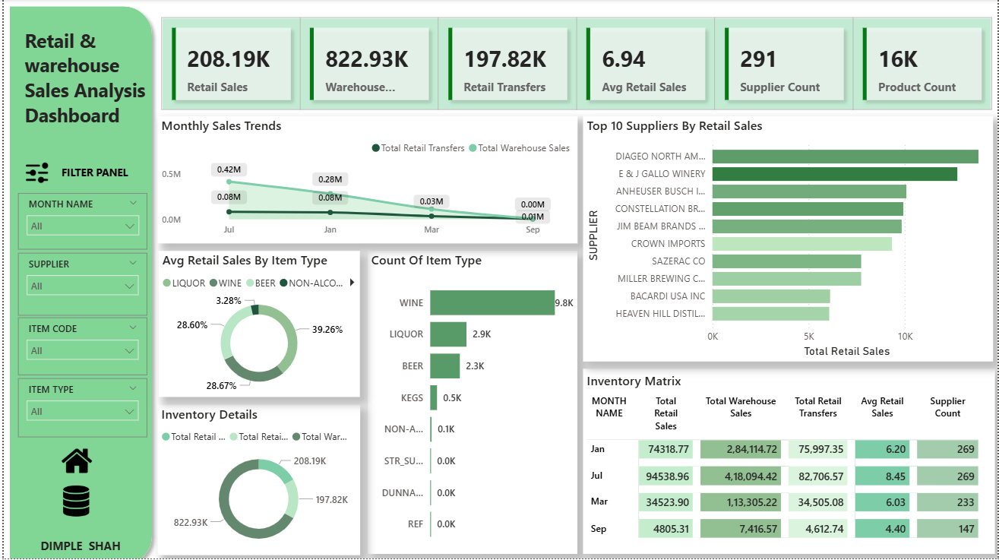

## 📊 Retail & Warehouse Sales Analysis Dashboard (Python & Power BI Capstone project):-

## 📌 Project Overview

This project presents an interactive Retail & Warehouse Sales Analysis Dashboard built using Power BI. The dashboard provides a consolidated view of retail sales, warehouse sales, retail transfers, suppliers, products, and inventory trends to support data-driven decision-making for supply chain, procurement, and sales teams.

The analysis focuses on:
Sales performance trends over time
Supplier-wise contribution to retail sales
Product & item-type distribution
Inventory movement between warehouse and retail
Key operational KPIs

---

## 🎯 Project Objectives

* Understand Retail & Warehouse sales trends
* Identify Top-performing suppliers
* Analyze item-type contribution (Liquor, Wine, Beer, etc.)
* Monitor inventory transfers between warehouse and retail
* Support better procurement and stock management decisions

---

## 📂 Dataset Information -->>>>

* **Dataset Name** : Cleaned Retail and Warehouse Sales
* **File Used** : Cleaned Retail and Warehouse Sales.csv
* **Source** : Kaggle (Retail and wherehouse Sale dataset)
* **Dashboard Tool** : Power BI
* **Notebook Cleaning File** : retail_sales.ipynb

🔗 <a href="https://github.com/dimple-shah-au13/Retail-and-Warehouse-Sales-Analysis/blob/main/Cleaned%20Retail%20and%20Warehouse%20Sales.csv">Dataset</a>

### Key Columns Included

* Month Name
* Supplier
* Item Code
* Item Type (Wine, Liquor, Beer, Non-Alcoholic, etc.)
* Retail Sales
* Warehouse Sales
* Retail Transfers

## 🛠 Tools & Technologies

* Power BI Desktop
* DAX (Measures & KPIs)
* Python (Pandas, Jupyter Notebook) for cleaning
* seaborn and matplotlib for EDA visuals
* Microsoft Excel / CSV

## 🧹 Data Cleaning & Preparation Steps

Data cleaning was performed using Python (Jupyter Notebook) and Power Query.
✅ Steps Followed:

1. Import Dataset
import pandas as pd
df = pd.read_csv("Retail and Warehouse Sales.csv")
2. Handled missing values
* Removed or filled missing sales values
* Dropped incomplete supplier/item records
3. Remove Duplicate Records
4. Converted numeric columns to correct data types
5. Standardize Column Names
6. Create Month Name Column
   MONTH NAME = 
   FORMAT(DATE('Cleaned Retail and Warehouse Sales'[YEAR], 'Cleaned Retail and Warehouse Sales'[MONTH], 1), "MMM")

7. Export Cleaned Dataset
 df.to_csv("Cleaned Retail and Warehouse Sales.csv", index=False)

## 🔑 Key Performance Indicators (KPIs)

* **Total Retail Sales** :	Total revenue from retail
* **Total Warehouse Sales** :	Total warehouse distribution
* **Total Retail Transfers** :	Inventory movement
* **Average Retail Sales** :	Avg sales per transaction
* **Supplier Count** :	Distinct suppliers
* **Product Count** :	Distinct item codes

## 🧮 DAX Measures

* **Total Retail Sales** = SUM('Cleaned Retail and Warehouse Sales'[RETAIL SALES])
* **Total Warehouse Sales** = SUM('Cleaned Retail and Warehouse Sales'[WAREHOUSE SALES])
* **Total Retail Transfers** = SUM('Cleaned Retail and Warehouse Sales'[RETAIL TRANSFERS])
* **Avg Retail Sales** = AVERAGE('Cleaned Retail and Warehouse Sales'[RETAIL SALES])
* **Supplier Count** = DISTINCTCOUNT('Cleaned Retail and Warehouse Sales'[SUPPLIER])
* **Product Count** = DISTINCTCOUNT('Cleaned Retail and Warehouse Sales'[ITEM CODE])

## 📈 Dashboard Visuals & Insights

## 1️⃣ Monthly Sales Trends

**Visual**: Line Chart
**Metrics**: Retail Transfers vs Warehouse Sales

**Insights**:
Warehouse sales show higher volume compared to retail transfers
Sales peak during mid-year months
Noticeable decline toward later months indicating seasonality

## 2️⃣ Top 10 Suppliers by Retail Sales

**Visual**: Horizontal Bar Chart
**Insights**:
DIAGEO North America leads retail sales
Top 5 suppliers contribute a significant share of total sales
Supplier concentration risk observed

## 3️⃣ Average Retail Sales by Item Type

**Visual**: Donut Chart
**Item Type Contribution**:
Wine: ~28.67%
Liquor: ~39.26%
Beer: ~28.60%
Non-Alcoholic & Others: ~3.28%

**Insights**:
Wine and Liquor dominate retail sales
Non-alcoholic products contribute minimal revenue

## 4️⃣ Count of Item Type

**Visual**: Bar Chart
**Insights**:
Wine has the highest product count
Liquor and Beer follow
Limited SKUs for specialty categories 

## 5️⃣ Inventory Details

**Visual**: Donut Chart
**Metrics**:
Total Warehouse Sales
Total Retail Sales
Total Retail Transfers

**Insights** :
Warehouse sales significantly exceed retail sales
High dependency on warehouse-to-retail transfers

## 6️⃣ Inventory Matrix (Monthly Summary)

**Visual**: Matrix Table
**Metrics**:
Total Retail Sales
Total Warehouse Sales
Retail Transfers
Average Retail Sales
Supplier Count

**Insights**:
* July records the highest average retail sales
* Supplier count varies month-to-month
Seasonal demand patterns observed

## 🎛 Filters & Interactivity

* Month Name
* Supplier
* Item Code
* Item Type
* Cross-filtering across all visuals

## 📓 Jupyter Notebook

You can view the full data cleaning and analysis notebook here:

🔗 **[View Notebook](https://github.com/dimple-shah-au13/Retail-and-Warehouse-Sales-Analysis/blob/main/retail_sales.ipynb)**

## 📷 Dashboard Interaction

🔗 **[View Raw Retail & Warehouse Sales Analysis Dashboard](https://github.com/dimple-shah-au13/Retail-and-Warehouse-Sales-Analysis/blob/main/Retail%20Sales%20Data%20with%20Seasonal%20Trends%20&%20Marketing.pbix)**

## 🔍 Business Recommendations

* Focus on high-performing suppliers to maximize revenue
* Diversify supplier base to reduce dependency risk
* Optimize inventory levels based on seasonal trends
* Increase promotional focus on low-performing item types
* Improve warehouse-to-retail transfer efficiency
*  Monitor seasonal dips to reduce overstocking

## 📷 Dashboard Preview

Here’s a preview of the interactive dashboard:

## 🚀 How to Use This Project

Download the repository
Open the Power BI (.pbix) file 
Load the cleaned CSV dataset
Refresh data
Use slicers to explore insights

## 👤 Author

**Dimple Shah**
- Data Analyst | Excel | Power BI | Tableau | SQL | Python | Business Intelligence Enthusiast

## GITHUB -->>>>

🔗 <a href ="https://github.com/dimple-shah-au13/Retail-and-Warehouse-Sales-Analysis/tree/main">GITHUB</a>

## ⭐ Support

If you like this project, don’t forget to ⭐ star the repository on GitHub!